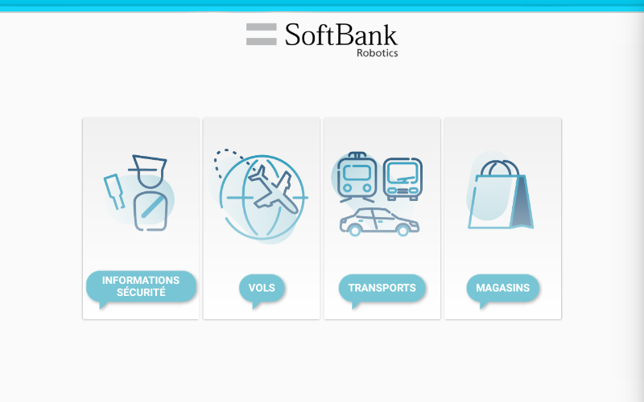

# Dynamic Conversation Menu Library



This Android library is helpful if you need to quickly build menus the users can navigate through by touching the tablet. You can also link the menus to a `Chat` where you define which `Bookmark` to reach in the `Chat` when an item is selected on the tablet.

The menus generated by the library are displayed in a `Fragment` you can include in your app UI.

## Getting Started

### Prerequisites

A robotified project for Pepper with QiSDK. Read the [documentation](https://developer.softbankrobotics.com/pepper-qisdk) if needed.

### Running the Sample Application

The project comes complete with a sample project. You can clone the repository, open it in Android Studio, and run this directly onto a robot.

Full implementation details are available to see in the project.

### Installing

[**Follow these instructions**](https://jitpack.io/#softbankrobotics-labs/dynamic-conversation-menu)

Make sure to replace 'Tag' by the number of the version of the library you want to use.

### Sample Application Content

The Sample Application shows an implementation of the library with a `Chat`. The main screen presents 4 options that, when selected, open Activities or submenus. The options can be selected by pressing the corresponding card on the tablet or by using the `Chat` and saying their names to the robot. For instance, for the  "Flights"  sections, if the user says "Flights" to the robot or if it presses the "Flights"  card on the screen, a submenu will appear where they can choose between "Departures" and "Arrivals" the same way. This behaviour is defined when the `Bookmark` "flights" is reached in the `Chat`.

## Usage

*This README assumes some standard setup can be done by the user, such as initialising variables or implementing code in the correct functions. Refer to the Sample Project for full usage code.*

To build the cards you want to display without linking the menu to a Chat, create an `ArrayList` of `MenuItemData` objects:
```
val cardList: ArrayList<MenuItemData> = ArrayList()
cardList.add(MenuItemData(getString(R.string.clothes), R.drawable.clothes))
cardList.add(MenuItemData(getString(R.string.store_infos), R.drawable.store_infos))
cardList.add(MenuItemData(getString(R.string.services), R.drawable.services))
```
⚠️ The ID given as the resource ID for the image on the card must be the ID of an image located in the "drawable" folder.
Then create and add a `DynamicConversationMenuFragment` with this list:
```
val fragmentManager = supportFragmentManager
val fragmentTransaction = fragmentManager.beginTransaction()
val fragment = DynamicConversationMenuFragment(cardList)
fragmentTransaction.add(R.id.menu_container, fragment)
fragmentTransaction.commit()
```
For more information on how to include a `Fragment` in your UI, [visit the official documentation](https://developer.android.com/guide/components/fragments).

To define the action to do when the card is selected on the tablet, you need to pass a lambda expression when building the cards. It will be triggered when the card is selected:
```
cardList.add(MenuItemData(getString(R.string.clothes), R.drawable.clothes) {
    startActivity(Intent(this, ClothesActivity::class.java))
})
```

You can also use this library to select a card in the menu with a `Chat`. If you aren't familiar with `Chat` and `Bookmark`, please refer to [this tutorial](https://developer.softbankrobotics.com/pepper-qisdk/api/conversation/tutorials/bookmark).

If you want to plug the menu with a `Chat`, specify the name of the `Bookmark` to reach when a card is selected when building it:
```
cardList.add(MenuItemData(getString(R.string.clothes), R.drawable.clothes, "clothes"))
```
Then, pass the `Topic` and the `QiChatBot` objects to the `DynamicConversationMenuFragment`:
```
val fragment = DynamicConversationMenuFragment(cardList, topic, qiChatbot)
```
This way, if the card is selected, the defined `Bookmark` will be reached and the action associated with it will be executed (such as opening a new `Activity`).

## License

This project is licensed under the BSD 3-Clause "New" or "Revised" License. See the [LICENSE](LICENSE.md) file for details.
